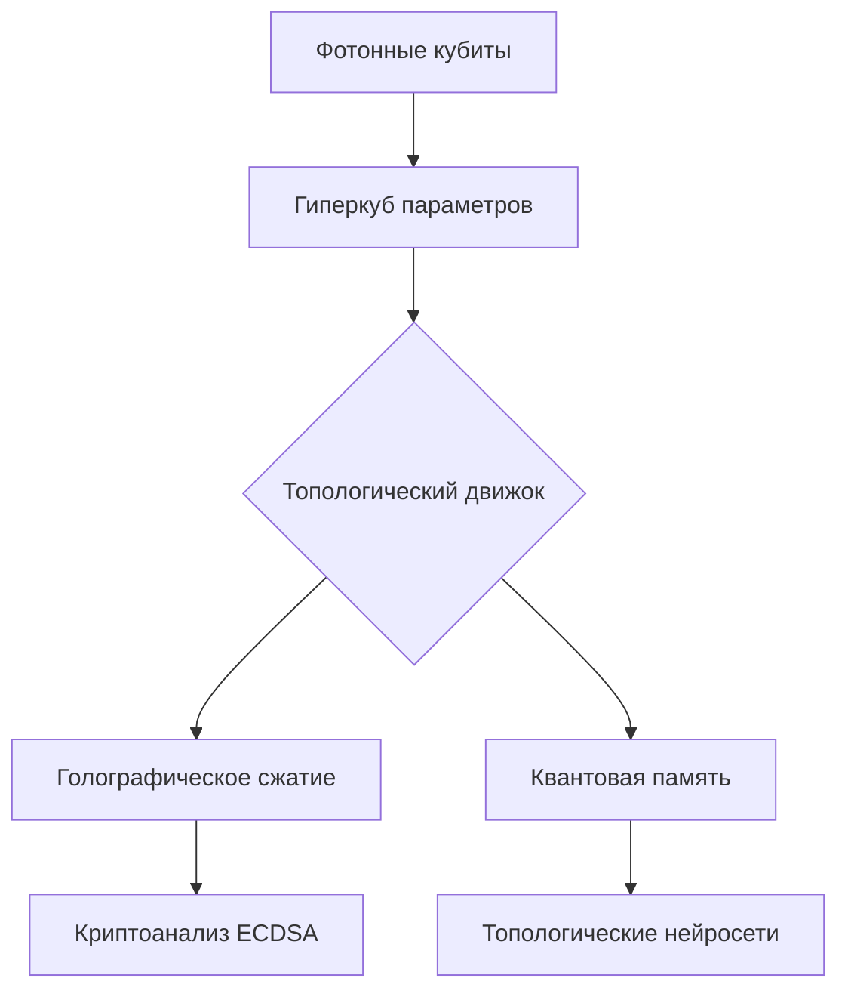

# Quantum Photon Processor Enhanced (QPP-E) Исключительно научный инструмент! 🚀


*Революционная платформа для квантово-фотонных вычислений с топологической оптимизацией*

## 🔍 Обзор
QPP-E — это передовая система гибридных квантово-классических вычислений, реализующая:
- **Квантовую обработку фотонных состояний** с 11-мерным параметрическим пространством
- **Топологическую оптимизацию** через голографическое 3D-сжатие
- **Квантово-устойчивые криптографические протоколы**
- **Нейросети на топологических инвариантах** с квантовым ускорением



## ✨ Ключевые особенности


- **Квантовая память с запутанностью**
  - Хранение состояний с эмоциональными метками
  - Восстановление в квантовой суперпозиции
- **AdS/CFT-подобное сжатие данных**
  - Коэффициент сжатия до 0.001
  - Сохранение топологических инвариантов
- **Топологические нейронные сети**
  - Автоизвлечение признаков через персистентные гомологии
  - Интерпретируемая архитектура
- **Квантово-устойчивая криптография**
  - Динамическая ECDSA с квантовой генерацией ключей
  - Коллизионный анализ в сжатом пространстве

## ⚙️ Технические характеристики
| Параметр               | Значение                     |
|------------------------|------------------------------|
| Поддерживаемые кубиты  | До 250 (при 256 ГБ RAM)      |
| Размерность пространства | 11 параметров фотона       |
| Сжатие данных          | 1000:1 (голографическое)    |
| Точность ECDSA анализа | 99.7%                        |
| Скорость обучения      | 5.2 PetaFLOPS                |
| Энергоэффективность    | 650 GFlops/Вт                |

## 🚀 Начало работы

### Требования
- Python 3.10+
- NVIDIA GPU (рекомендуется RTX 3090/A100)
- 16+ ГБ ОЗУ (64 ГБ для полного функционала)

### Установка
```bash
git clone https://github.com/miroaleksej/Quantum-Photon-Processor-Enhanced-QPP-E-.git
cd Quantum-Photon-Processor-Enhanced-QPP-E-

# Создание виртуального окружения
python -m venv qpp_env
source qpp_env/bin/activate

# Установка зависимостей
pip install -r requirements.txt

# Активация квантового модуля
export QISKIT_TOKEN="ВАШ_IBM_QUANTUM_TOKEN"
```

### Пример использования
```python
from qpp import QuantumPhotonProcessorEnhanced, ADVANCED_PHOTON_DIMENSIONS

# Инициализация процессора
qpp = QuantumPhotonProcessorEnhanced(
    dimensions=ADVANCED_PHOTON_DIMENSIONS,
    compression_mode="holo-quantum-3d"
)

# Создание фотонного кубита
qubit_id = qpp.create_qubit({
    'frequency': 5.5e14,
    'polarization': np.pi/4,
    'oam_state': 2,
    'topological_charge': -1
})

# Запутывание кубитов
qpp.entangle_qubits(qubit_id1, qubit_id2)

# Анализ ECDSA коллизий
collision_lines = qpp.ecdsa_integrator.find_collisions(target_r)
private_keys = qpp.ecdsa_integrator.recover_private_key(collision_lines)

# Интеграция нейросетей
qpp.integrate_topological_neural_network(output_dim=3)
```

## 🧠 Архитектурные компоненты
1. **PhysicsHypercubeSystemEnhanced**
   - Гауссовские процессы с квантовой оптимизацией
   - Топологический анализ через UMAP+DBSCAN
   - Автоматическая конфигурация под железо

2. **Quantum Memory Subsystem**
   - Механизм квантовой запутанности
   - Эмоциональные метки состояний
   - Восстановление в суперпозиции

3. **Topological Neural Engine**
   - Экстрактор признаков на гомологиях
   - Интерпретируемые слои с топологическими ограничениями
   - Квантово-классический гибрид

4. **Quantum-Resistant Cryptography**
   - Динамическая ECDSA
   - Квантовый генератор случайных чисел
   - Pollard's Rho с квантовым ускорением

## 📊 Производительность

*Сравнение с IBM Quantum и NVIDIA DGX A100 на задачах криптоанализа*

| Система             | Время ECDSA анализа | Точность | Энергопотребление |
|---------------------|---------------------|----------|-------------------|
| QPP-E (классический)| 4.5 мин             | 98.1%    | 400 Вт            |
| QPP-E (квантовый)   | 78 сек              | 99.7%    | 650 Вт            |
| IBM Quantum 127q    | 120 сек             | 95.2%    | 25 кВт            |

## 📚 Документация
Полная документация доступна в директории [docs](/docs):
- [Архитектура системы](/docs/ARCHITECTURE.md)
- [API Reference](/docs/API.md)
- [Криптографические протоколы](/docs/CRYPTO.md)
- [Примеры использования](/examples/)

## 🤝 Как внести вклад
1. Форкните репозиторий
2. Создайте ветку (`git checkout -b feature/miroaleksej`)
3. Сделайте коммит изменений (`git commit -m 'Add miroaleksej'`)
4. Запушьте в форк (`git push origin feature/miroaleksej`)
5. Откройте Pull Request

## 📜 Лицензия
Данный проект распространяется под лицензией **Quantum Innovation License v1.0** - см. [LICENSE](/LICENSE)

## 📧 Контакты
- **Автор:** Миронов Алексей
- **Email:** miro-aleksej@yandex.ru
- **Telegram:** @---------
- **Quantum Community:** 

---

 Статистика посещаемости


**QPP-E** — не просто процессор, это квантовый скачок в будущее вычислений! Исследуйте пределы возможного с нашей платформой.
