### Архитектура системы Quantum Photon Processor (QPP)


**Назначение:** Моделирование квантовых фотонных систем с интеграцией топологического анализа, машинного обучения и криптографии для решения задач в физике высоких энергий и квантовых вычислениях.

---

### Ключевые инновационные компоненты:

#### 1. **PhysicsHypercubeSystemEnhanced**
Многомерное пространство параметров с квантовой оптимизацией:
- **Голографическое 3D-сжатие**:  
  Проекция данных в 3D через UMAP с сохранением только критических точек и топологических инвариантов.
  ```python
  def holographic_compression_3d(self, compression_ratio=0.005):
      reducer = umap.UMAP(n_components=3)
      compressed_points = reducer.fit_transform(points)
      self.boundary_data = {topological_invariants, critical_points...}
  ```

- **Квантовая оптимизация GP**:  
  Замена классических гауссовских процессов на квантовые (QGPR) с использованием Qiskit:
  ```python
  quantum_kernel = QuantumKernel(feature_map=ZZFeatureMap())
  qgpr = QGPR(quantum_kernel).fit(X, y)
  ```

- **Топологический анализ**:  
  Вычисление персистентных гомологий и чисел Бетти для выявления структурных инвариантов.

#### 2. **QuantumPhotonProcessorEnhanced**
Управление фотонными кубитами с топологической оптимизацией:
- **Динамическое сжатие состояний**:  
  Автоматическая активация голографического сжатия при нехватке памяти.
  ```python
  def compress_system(self):
      self.system.holographic_compression_3d()
      self.system.quantum_entanglement_optimization()
  ```

- **Запутывание с топологической редукцией**:  
  Проекция параметров кубитов в 3D-подпространство перед запутыванием:
  ```python
  def entangle_qubits(self, qubit1, qubit2):
      subspace = self._create_entanglement_subspace([qubit1, qubit2])
      reduced_points = self.quantum_topology.topological_dimensionality_reduction(subspace)
  ```

- **Квантовая память**:  
  Сохранение состояний с эмоциональными метками и квантовой запутанностью:
  ```python
  memory = {
      'content': qubit_states, 
      'emotion_vector': [0.8, 0.2, 0.5],
      'quantum_state': [0.54, 0.12...]
  }
  ```

#### 3. **Топологические нейронные сети (TopoNN)**
Гибридная архитектура для интерпретируемого машинного обучения:
- **Топологические признаки**:  
  Извлечение персистентных диаграмм, кривых Бетти и ландшафтов:
  ```python
  diagrams = VietorisRipsPersistence()(X)
  betti_features = BettiCurve(n_bins=20)(diagrams)
  ```

- **Квантово-классический гибрид**:  
  Использование параметризованных квантовых схем для улучшения признаков:
  ```python
  quantum_circuit = self._create_quantum_circuit()
  qnn = CircuitQNN(circuit=quantum_circuit)
  hybrid_features = qnn.forward(X_topo)
  ```

#### 4. **Криптографическая интеграция**
- **Квантово-устойчивые ECDSA-подписи**:  
  Динамическая генерация базовых точек и квантовая генерация `k`.
- **Коллизионный анализ**:  
  Поиск уязвимостей в эллиптических кривых через топологию гиперкуба:
  ```python
  collision_lines = ecdsa_integrator.find_collisions(target_r)
  private_key = ecdsa_integrator.recover_private_key(collision_lines)
  ```

---

### Поток данных в системе:

```mermaid
graph LR
A[Фотонные параметры] --> B[PhysicsHypercube]
B -->|3D-сжатие| C[Голографическое представление]
C --> D[Топологический анализ]
D --> E[Квантовая оптимизация GP]
E --> F[QuantumPhotonProcessor]
F --> G[Управление кубитами]
G --> H[Квантовая память]
H --> I[Топологические нейронные сети]
I --> J[Интерпретируемые предсказания]
```


---

### Научная ценность:
1. **Физика**: Моделирование нелокальных квантовых корреляций через топологию.
2. **ML**: Гибридные модели с квантовым ускорением и интерпретируемостью.
3. **Криптография**: Практическая реализация квантово-устойчивых схем.
4. **Data Science**: Методы сжатия многомерных данных с сохранением топологических свойств.

Система демонстрирует парадигму "Physics-Informed AI", где фундаментальные законы физики напрямую интегрированы в архитектуру алгоритмов.
